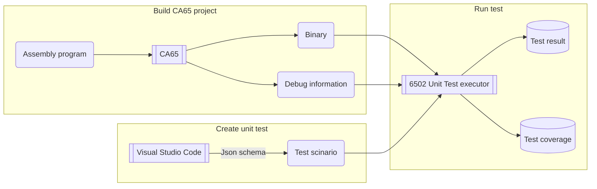

# 6502 Unit Test executor

[](https://github.com/AsaiYusuke/6502_test_executor/actions/workflows/make.yml)

This tool enables [unit testing](https://en.wikipedia.org/wiki/Unit_testing) for [MOS Technology 6502](https://en.wikipedia.org/wiki/MOS_Technology_6502) assembly programs on a cross-platform basis.

## Table of Contents
* [Basic design](#Basic-design)
* [Supported testing feature](#Supported-testing-feature)
* [Getting started](#getting-started)
  * [Prerequisites](#Prerequisites)
  * [Install](#Install)
  * [Test example project](#Test-example-project)
    * [Unit testing](#Unit-testing)
    * [Coverage](#Coverage)
* [Usage](#Usage)
  * [Build CA65 project with debug option](#Build-CA65-project-with-debug-option)
  * [Create unit test](#Create-unit-test)
  * [Run test](#Run-test)
* [Tested CA65 version](#Tested-CA65-version)
* [Test scinario examples](#Test-scinario-examples)
* [Dependencies](#Dependencies)

## Basic design
### *Execute test on embedded emulator*
- Built-in [6502 emulation by Gianluca Ghettini](https://github.com/gianlucag/mos6502) enables stand-alone testing on Linux, etc.
### *Write test with JSON Schema*
- The tool provides [JSON Schema](https://json-schema.org/) document that makes it easy to create test.
### *Evaluate test like modern frameworks*
- It comes with many useful evaluation methods found in [the modern UNIT testing frameworks](https://en.wikipedia.org/wiki/List_of_unit_testing_frameworks).

## Supported testing feature

- Setup device conditions before test  
  |                         |      Register      |       Memory       |       Stack        |
  | :---------------------- | :----------------: | :----------------: | :----------------: |
  | Set value               | :heavy_check_mark: | :heavy_check_mark: | :heavy_check_mark: |
  | Mock read value history |                    | :heavy_check_mark: |                    |
- Evaluate device conditions after test  
  |                           |      Register      |       Memory       |       Stack        |
  | :------------------------ | :----------------: | :----------------: | :----------------: |
  | Check value               | :heavy_check_mark: | :heavy_check_mark: | :heavy_check_mark: |
  | Check read/write count    | :heavy_check_mark: | :heavy_check_mark: |                    |
  | Check write value history |                    | :heavy_check_mark: |                    |
- Evaluate processor information
  - Cycle count
- Testable procedures
  - JSR
  - NMI
  - IRQ
  - Address range
- Mockable call instructions that can output results to each register and memory
  - JSR
  - JMP
- Types of interrupts that can occur during testing
  - NMI
  - IRQ
- Assertion operator how test is evaluated
  - *"eq"* (Equal to)
  - *"ne"* (Not equal to)
  - *"gt"* (Greater than)
  - *"ge"* (Greater than or equal to)
  - *"lt"* (Less than)
  - *"le"* (Less than or equal to)
  - *"anyOf"* (Any of)  
    Representing logical OR operator
  - Composite operators  
    Same as logical AND operator. e.g. "*gt*"+"*lt*" for range selection
- Error handling
  - Write access to readonly memory
  - Access to undefined memory
  - Illegal instruction
- Testable coverage
  - [LCOV](https://github.com/linux-test-project/lcov) format

### Additional useful feature

- When a test terminates with an error, its callback trace can be output.
- Test evaluations can be executed at any address.
- Test ROM images are detected from debug information file.

## Getting started

### Prerequisites
This tool is intended for the projects based on [CC65](https://cc65.github.io/).

The easiest way to install CC65 on [Ubuntu](https://ubuntu.com/) linux is by running:

```
# sudo apt-get install cc65
```

### Install
Since the tool repository has the submodules, the `--recurse-submodules` option must be specified when cloning:

```
# git clone --recurse-submodules https://github.com/AsaiYusuke/6502_test_executor.git
# cd 6502_test_executor
# make
# ./6502_tester --help
```

### Test example project

#### Unit testing
[Simple example project](https://github.com/AsaiYusuke/6502_test_executor/tree/master/example) includes many test cases that demonstrate the features:

```
# cd example
# make
mkdir -p build
ca65 --cpu 6502 --target nes --debug-info -o build/example.o src/example.asm
mkdir -p dist
ld65  -o dist/example.nes --dbgfile dist/example.dbg --config cfg/nes.cfg --obj build/example.o
rm coverage/lcov.info
../6502_tester --debug=dist/example.dbg --coverage=coverage/lcov.info --segment="CODE" --quiet-summary --quiet-ok -t test/ok/customize.configurations.test.json
../6502_tester --debug=dist/example.dbg --coverage=coverage/lcov.info --segment="CODE" --quiet-summary --quiet-ok -t test/ok/definitions.test.json
../6502_tester --debug=dist/example.dbg --coverage=coverage/lcov.info --segment="CODE" --quiet-summary --quiet-ok -t test/ok/error.timeout.test.json
:
All tests passed.
```

#### Coverage
When the project is built, the coverage file is saved.
It is located on `example/coverage/lcov.info` in case of example project.

The coverage file can be used to populate [Coveralls GitHub Action](https://github.com/marketplace/actions/coveralls-github-action), etc.

The results of the example project can be seen in [Coveralls](https://coveralls.io/github/AsaiYusuke/6502_test_executor).\
[](https://coveralls.io/github/AsaiYusuke/6502_test_executor?branch=master)

## Usage



### Build CA65 project with debug option
Build your 6502 project using [CA65 assembler](https://cc65.github.io/doc/ca65.html)/[LD65 linker](https://cc65.github.io/doc/ld65.html) with *debug information generation* enabled.

### Create unit test
Create test scinario files containing the three key items in JSON format:

- *Test target*  
the starting address of the test procedure
- *Setup condition*  
the settings of the register and memory to make before the test
- *Expected condition*  
the expected responses of the register and memory after the test

#### [JSON Schema file](https://github.com/AsaiYusuke/6502_test_executor/blob/master/schema/testcase.schema.json)
The tool also provides a [JSON Schema](https://json-schema.org/) document that makes it easy to create test scinario files.
If you use [Visual Studio Code](https://code.visualstudio.com/), it will tell you about formatting error and element completion candidates based on JSON Schema without any extensions.

### Run test
Run the tool with the prepared debug information file and test scenario file:

```
6502_tester -d <debug information> -t <test scinario>
```

Test coverage can also be measured.
Both the coverage file and the segment names used in the debug information file must be specified to enable.

```
6502_tester -d <debug information> -t <test scinario> -c <coverage> -s <segment names>
```

You can find all command line arguments in help:

```
# ./6502_tester --help
  ./6502_tester {OPTIONS}

    6502 test executor

  OPTIONS:

      -h, --help                        Show this help menu.
      -d[DEBUG], --debug=[DEBUG]        Specify the path of the debug
                                        information file used for testing.
      -t[TEST], --test=[TEST]           (REQUIRED)
                                        Specify the path of the test scinario
                                        file.
      -c[COVERAGE],
      --coverage=[COVERAGE]             Specify the path of the coverage file.
      -s[SEGMENT], --segment=[SEGMENT]  Specify the segment names for coverage.
      -i[ID], --id=[ID]                 Specify the test ID.
      --timeout=[TIMEOUT]               Specify the timeout period before the
                                        test becomes an error.
      -q, --quiet                       Do not show any output.
      --quiet-ok                        Do not show the successful output.
      --quiet-fail                      Do not show the failed output.
      --quiet-summary                   Do not show the test summary output.

```

### Note:
Some options can be specified either as command line arguments or test scenario file ([See example](https://github.com/AsaiYusuke/6502_test_executor/blob/master/example/test/ok/customize.configurations.test.json)).  
If both are specified, the values in the test scenario file are adopted.

## Tested CA65 version

```
# ca65 --version
ca65 V2.18 - Ubuntu 2.19-1
```

## Test scinario examples

### Register conditions
- [Check value of A/X/Y registers](https://github.com/AsaiYusuke/6502_test_executor/blob/master/example/test/ok/register.axy.value.test.json)
- [Check read/write count of A/X/Y registers](https://github.com/AsaiYusuke/6502_test_executor/blob/master/example/test/ok/register.axy.count.test.json)
- [Check value of Processor status register flags](https://github.com/AsaiYusuke/6502_test_executor/blob/master/example/test/ok/register.status.flag.value.test.json)
- [Check read/write count of Processor status register flags](https://github.com/AsaiYusuke/6502_test_executor/blob/master/example/test/ok/register.status.flag.count.test.json)
- [Check machine when PC register arrives at a specific address](https://github.com/AsaiYusuke/6502_test_executor/blob/master/example/test/ok/init.code.test.json)
### Memory conditions
- [Memory addressing](https://github.com/AsaiYusuke/6502_test_executor/blob/master/example/test/ok/memory.addressing.test.json)
- [Check value of memory](https://github.com/AsaiYusuke/6502_test_executor/blob/master/example/test/ok/memory.value.check.test.json)
- [Check read/write count of memory](https://github.com/AsaiYusuke/6502_test_executor/blob/master/example/test/ok/memory.count.check.test.json)
- [Batch selection of continuous memory area](https://github.com/AsaiYusuke/6502_test_executor/blob/master/example/test/ok/memory.contiguous.memory.area.test.json)
- [Sequential change value](https://github.com/AsaiYusuke/6502_test_executor/blob/master/example/test/ok/memory.sequential.change.value.test.json)

### Stack conditions
- [Check value of stack](https://github.com/AsaiYusuke/6502_test_executor/blob/master/example/test/ok/stack.value.check.test.json)
- [rts to caller](https://github.com/AsaiYusuke/6502_test_executor/blob/master/example/test/ok/stack.rts.check.test.json)

### Processor conditions
- [Cycle count information](https://github.com/AsaiYusuke/6502_test_executor/blob/master/example/test/ok/error.timeout.test.json)
- [Interrupt hooks](https://github.com/AsaiYusuke/6502_test_executor/blob/master/example/test/ok/interrupt.test.json)
- [Call mocked proc](https://github.com/AsaiYusuke/6502_test_executor/blob/master/example/test/ok/mock.proc.test.json)

### Testable procedures
  - [JSR proc](https://github.com/AsaiYusuke/6502_test_executor/blob/master/example/test/ok/test_type/jsr.test.json)
  - [NMI proc](https://github.com/AsaiYusuke/6502_test_executor/blob/master/example/test/ok/test_type/nmi.test.json)
  - [IRQ proc](https://github.com/AsaiYusuke/6502_test_executor/blob/master/example/test/ok/test_type/irq.test.json)
  - [Address range](https://github.com/AsaiYusuke/6502_test_executor/blob/master/example/test/ok/test_type/address.test.json)

### Error handling
- [Write to readonly memory](https://github.com/AsaiYusuke/6502_test_executor/blob/master/example/test/fail/error.readonly.test.json)
- [Access to out of segment](https://github.com/AsaiYusuke/6502_test_executor/blob/master/example/test/fail/error.out_of_segment.test.json)
- [Illegal instruction](https://github.com/AsaiYusuke/6502_test_executor/blob/master/example/test/fail/error.illegal_instruction.test.json)

### Misc
- [Customize configurations](https://github.com/AsaiYusuke/6502_test_executor/blob/master/example/test/ok/customize.configurations.test.json)
- [Skip test (ignore)](https://github.com/AsaiYusuke/6502_test_executor/blob/master/example/test/ok/skip.test.json)
- [Complex evaluation](https://github.com/AsaiYusuke/6502_test_executor/blob/master/example/test/ok/evaluation.test.json)
- [Definitions](https://github.com/AsaiYusuke/6502_test_executor/blob/master/example/test/ok/definitions.test.json)

## Dependencies
This project uses following project:
- [Gianluca Ghettini's 6502 emulator](https://github.com/gianlucag/mos6502)
  - [Erik Lothe's 6502 Unit test executor](https://github.com/89erik/6502_test_executor)
- [Taylor C. Richberger's args](https://github.com/Taywee/args)
- [Niels Lohmann's JSON for Modern C++](https://github.com/nlohmann/json)
